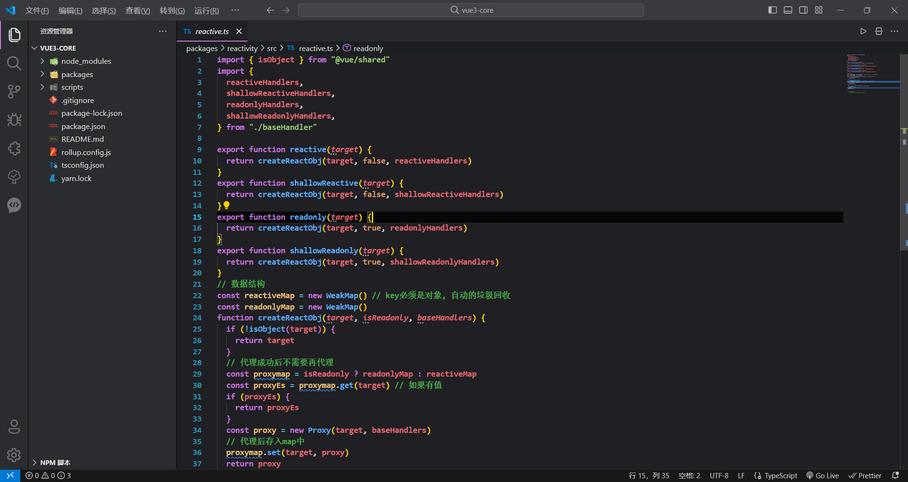
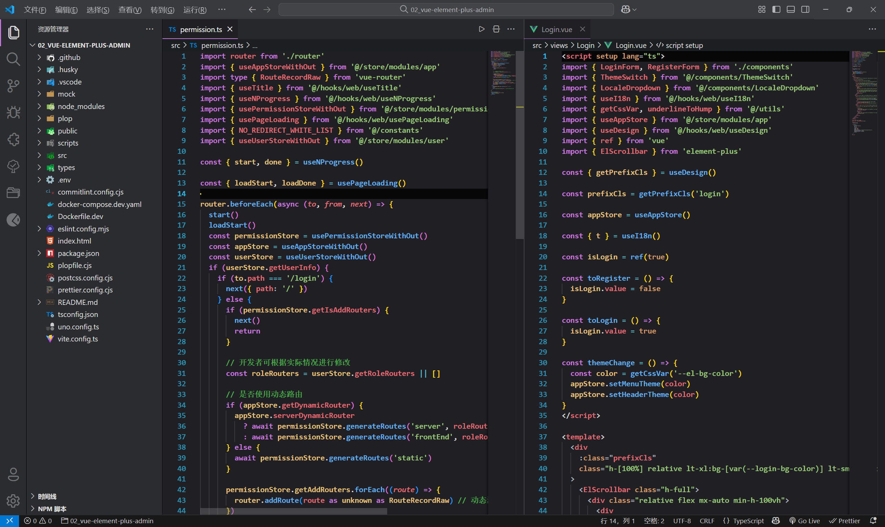
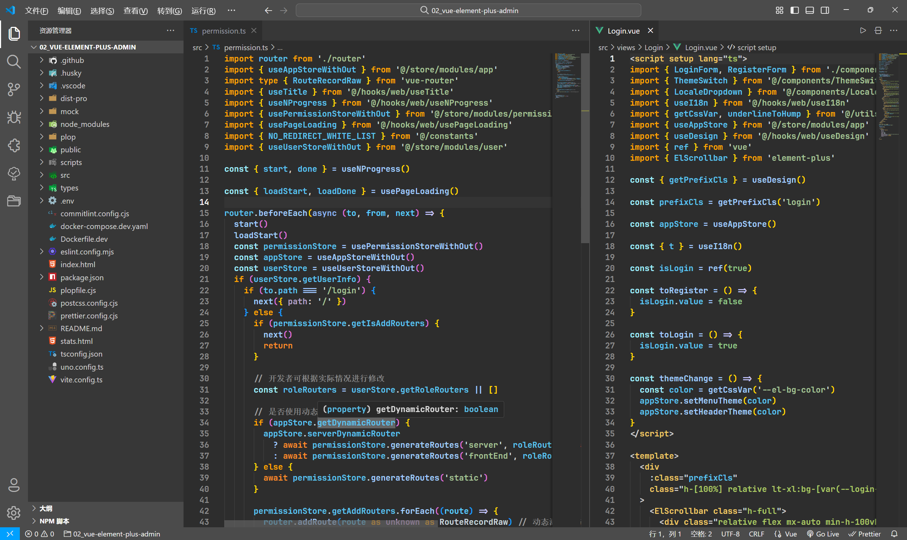
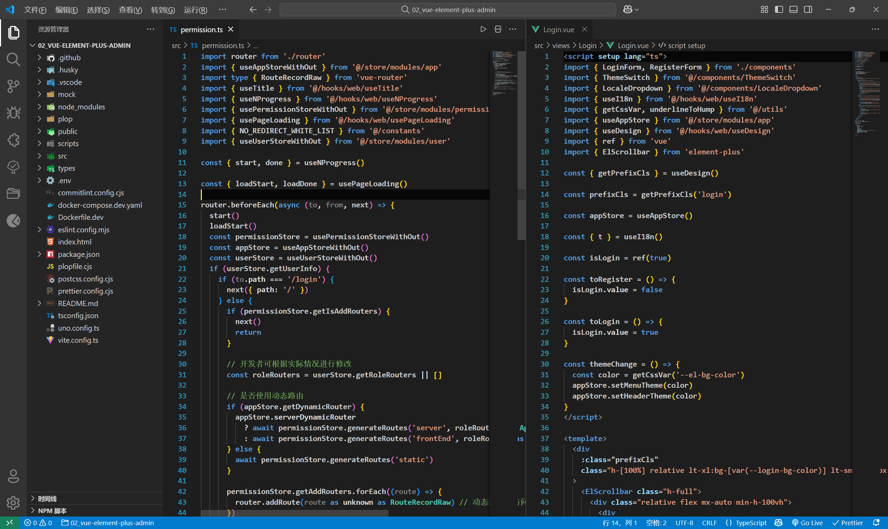
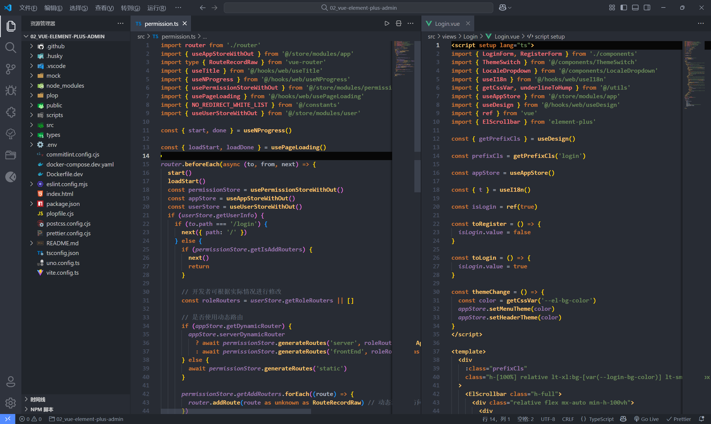

**_welcome use tang-dark-pro dark theme!!!_**

# 安装 vscode 依赖

```
npm i vscode
```

# 主题打包成 VSIX 格式

```
vsce package
```

# 主题预览

tang dark pro:



tang dark1 pro:



tang dark2 pro:



tang dark3 pro:



tang dark4 pro:


